# psxtui

A terminal client for **Pakistan Stock Exchange** market data — live quotes, a
full-market screener, candlestick charts with technical indicators, risk and
return analytics, company fundamentals, and intraday microstructure.

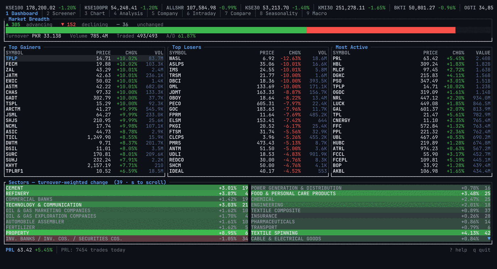

## Screens

| # | Screen | What it shows |
|---|--------|---------------|
| 1 | **Dashboard** | Market breadth, top gainers/losers, most active by value, scrollable sector heatmap |
| 2 | **Screener** | Every listed scrip — sortable and filterable by symbol, name or sector, plus valuation columns |
| 3 | **Chart** | Candlesticks with SMA/EMA/Bollinger/Donchian/Ichimoku, and a Volume / RSI / MACD / ATR / Stochastic / ADX / CCI / Williams %R pane |
| 4 | **Analysis** | Returns by window, annualized return & volatility, Sharpe, Sortino, max drawdown, beta and correlation vs KSE100 |
| 5 | **Company** | Business profile, key people, equity structure, annual & quarterly financials, ratios, announcements |
| 6 | **Intraday** | Session price with VWAP, 15-minute volume distribution, live trade tape |
| 7 | **Compare** | 2-8 scrips side by side — rebased performance overlay, risk table, correlation matrix |
| 8 | **Seasonality** | Month-by-year return grid, day-of-week effects, return distribution, streaks |
| 9 | **Macro** | 20 external series — energy, metals, agriculture, freight, FX, crypto — plus the SBP policy rate and business news, with correlation to the selected scrip |
| 0 | **Backtest** | Run a strategy over five years of history — equity curve against buy-and-hold, trade list, parameter sweep, walk-forward validation and a market-wide scan |

Timeframes: 5D, 1M, 3M, 6M, YTD, 1Y, 2Y, 3Y, 5Y and MAX.

<table>
<tr><td width="50%"><a href="docs/chart.png">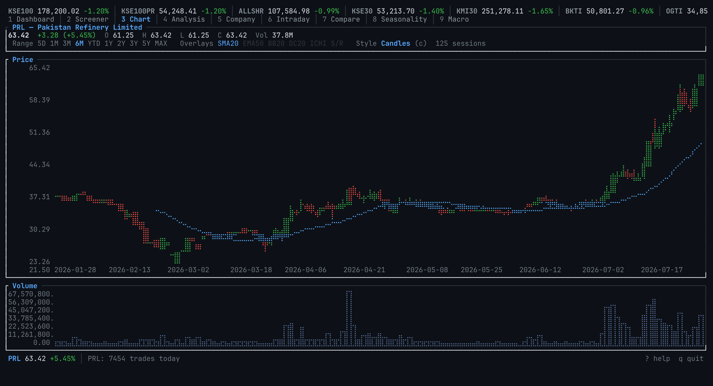</a><br><b>Chart</b> — candles, SMA/EMA overlays, volume pane</td>
<td width="50%"><a href="docs/compare-full.png">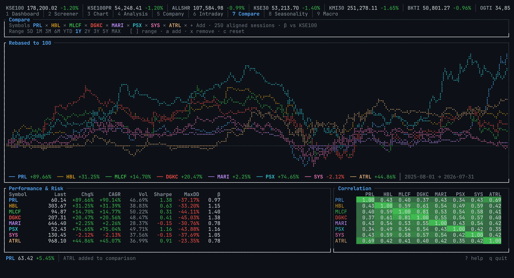</a><br><b>Compare</b> — up to eight scrips rebased, with risk and correlations</td></tr>
<tr><td><a href="docs/screener.png">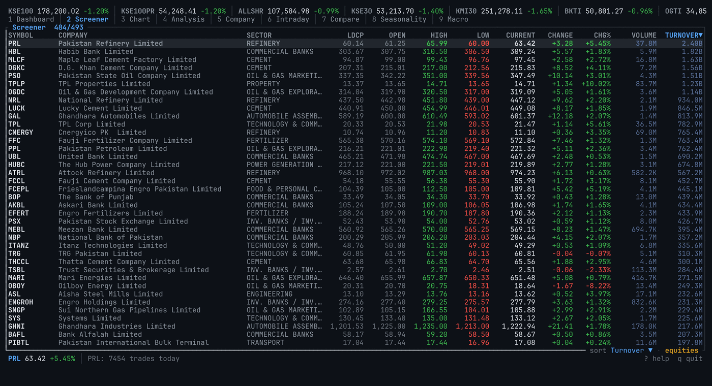</a><br><b>Screener</b> — every listed scrip, sortable</td>
<td><a href="docs/macro.png">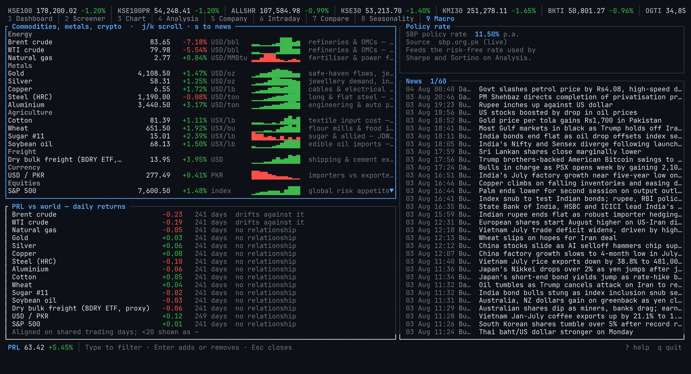</a><br><b>Macro</b> — commodities, FX, policy rate, headlines</td></tr>
</table>

<details>
<summary>The other five screens</summary>

| | |
|---|---|
| **Analysis** | 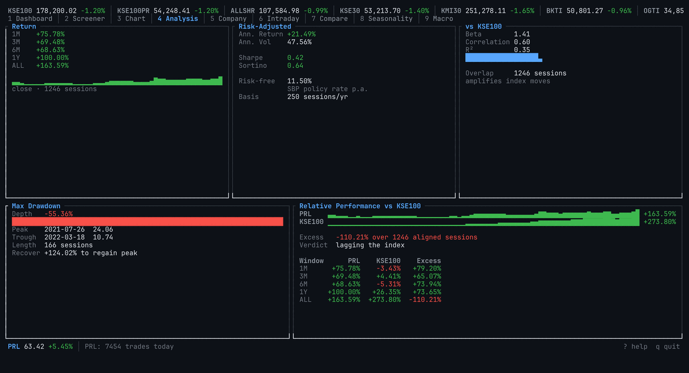 |
| **Company** | 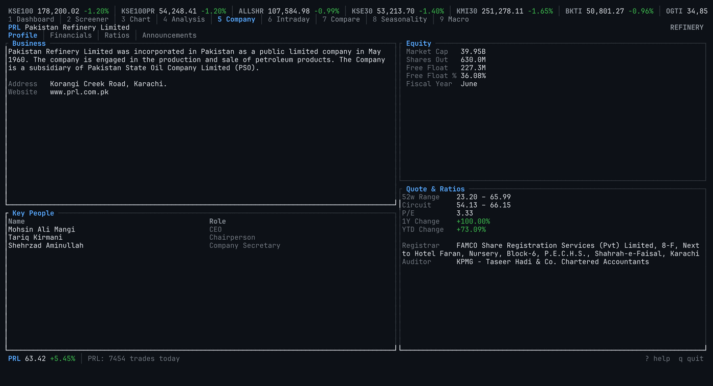 |
| **Intraday** | 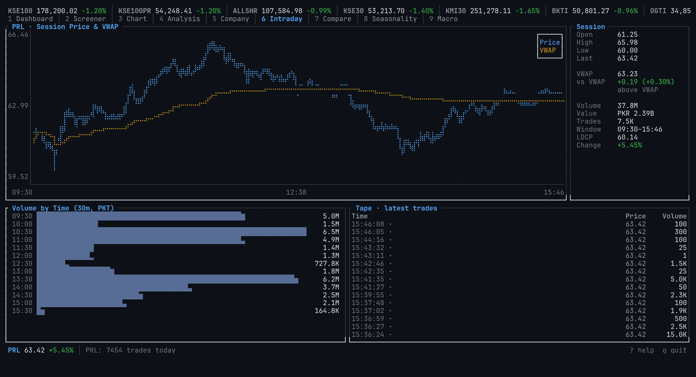 |
| **Seasonality** | 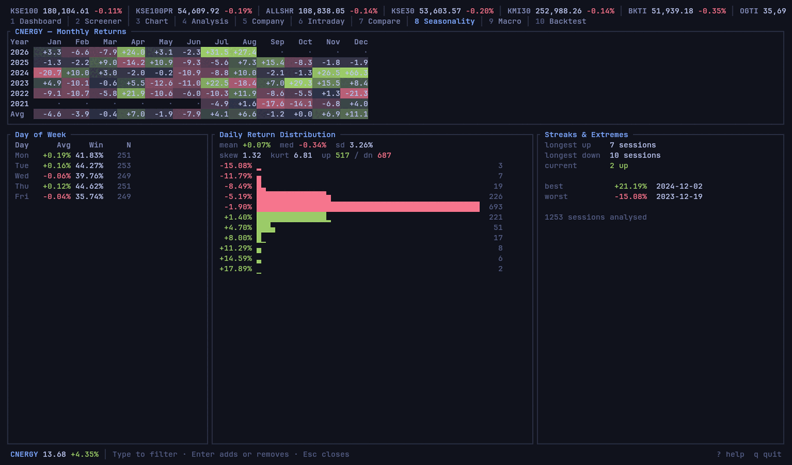 |
| **Keys (`?`)** | 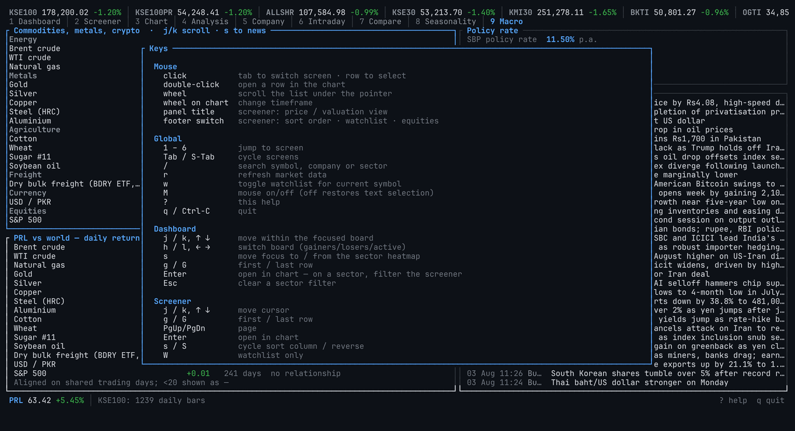 |

</details>


## Install

Runs on **Linux, macOS and Windows**. No API key, no account, no configuration —
just a terminal with 256-colour and Unicode support. Building from source needs
Rust **1.88 or newer** (the code uses let-chains); the prebuilt binaries on the
[releases page](https://github.com/AnnanKhan/PSXtui/releases) need nothing at all.

### Linux and macOS — the script

`install.sh` does the whole thing end to end: it installs a Rust toolchain if
there isn't a usable one, builds a release binary, and puts `psxtui` on your
PATH.

```sh
git clone https://github.com/AnnanKhan/PSXtui.git
cd PSXtui
./install.sh
psxtui
```

| Flag | Effect |
|------|--------|
| *(none)* | Install for the current user into `~/.cargo/bin` |
| `--system` | Install into `/usr/local/bin` instead (uses `sudo`) |
| `--no-modify-path` | Never touch your shell profile |
| `--uninstall` | Remove the binary; the cache and watchlist stay |

It only appends to `~/.bashrc` / `~/.zshrc` / `~/.profile` when `~/.cargo/bin`
is genuinely missing from your PATH, and prints every step as it goes. Re-run it
any time to update after a `git pull`.

### Windows

`install.ps1` downloads the prebuilt `psxtui.exe` — no Rust, no Visual Studio,
nothing to compile — and puts it on your PATH:

```powershell
git clone https://github.com/AnnanKhan/PSXtui.git
cd PSXtui
.\install.ps1
psxtui
```

Or skip the clone entirely: download `psxtui-<version>-x86_64-pc-windows-msvc.exe`
from the [releases page](https://github.com/AnnanKhan/PSXtui/releases), rename it to
`psxtui.exe`, and put it wherever you keep such things. It is a single
self-contained binary — SQLite is compiled in and there is nothing to install
alongside it. The `.zip` beside it holds the same binary plus this README, and is
what `install.ps1` downloads.

Windows will warn that the binary is unsigned the first time you run it — there is
no code-signing certificate behind this project. The `.sha256` file next to each
download lets you confirm you got what CI built.

| Flag | Effect |
|------|--------|
| *(none)* | Download the released binary into `%LOCALAPPDATA%\Programs\psxtui` |
| `-FromSource` | Build it with cargo instead (needs Rust + the VS C++ build tools) |
| `-NoModifyPath` | Never touch the user PATH |
| `-Uninstall` | Remove the binary and its PATH entry; the cache stays |

**Use [Windows Terminal](https://aka.ms/terminal).** It is what does truecolour,
mouse reporting and the box-drawing glyphs the whole UI is built from; the legacy
`conhost` console will look wrong. If the charts come out as empty boxes your font
has no braille — install a [Nerd Font](https://www.nerdfonts.com/), or run with
`PSXTUI_MARKER=block` (see [Environment](#environment)).

Building from source on Windows additionally needs the **Visual Studio C++ build
tools** for the bundled SQLite — `winget install Microsoft.VisualStudio.2022.BuildTools`,
with the "Desktop development with C++" workload. Nothing else: TLS is rustls
over *ring*, deliberately, so there is no NASM, CMake or OpenSSL to install.

### By hand

The same four steps, if you would rather run them yourself:

```sh
# 1. a toolchain (skip if `rustc --version` already reports 1.88+)
curl --proto '=https' --tlsv1.2 -sSf https://sh.rustup.rs | sh -s -- -y
. "$HOME/.cargo/env"

# 2. the sources
git clone https://github.com/AnnanKhan/PSXtui.git && cd PSXtui

# 3. build — first release build takes a few minutes
cargo build --release

# 4a. run it straight out of the build directory
./target/release/psxtui

# 4b. …or install it onto your PATH
cargo install --path .
```

`cargo install` drops the binary in `~/.cargo/bin`, which rustup already adds to
PATH. If `psxtui` still isn't found, add it yourself:

```sh
echo 'export PATH="$HOME/.cargo/bin:$PATH"' >> ~/.bashrc && exec $SHELL
```

**Dependencies.** TLS is rustls and SQLite is bundled, so there are no `-dev`
packages to hunt down — but compiling that bundled SQLite needs a C compiler:
`build-essential` on Debian/Ubuntu, `gcc` on Fedora, `xcode-select --install` on
macOS.

**Uninstalling.** `./install.sh --uninstall` (`.\install.ps1 -Uninstall` on
Windows), or `cargo uninstall psxtui`. All of them leave your cache and
watchlist alone; delete the database below to remove those too.

```
psxtui --version    # 0.1.0
psxtui --help       # the two flags there are, plus where your data lives
```

### Where things live

| Platform | Cache and watchlist | Strategies |
|----------|---------------------|------------|
| Linux | `~/.local/share/psxtui/psx.db` | `~/.local/share/psxtui/strategies/` |
| macOS | `~/Library/Application Support/psxtui/psx.db` | `~/Library/Application Support/psxtui/strategies/` |
| Windows | `%APPDATA%\psxtui\data\psx.db` | `%APPDATA%\psxtui\data\strategies\` |

`psxtui --help` prints the real path for the machine it is running on.

### Environment

| Variable | Effect |
|----------|--------|
| `PSXTUI_THEME=nord` | Start in a theme — `terminal`, `midnight`, `nord`, `gruvbox`, `solarized`, `paper` or `amber`. Overrides the theme saved by the last session. |
| `PSXTUI_GRAPHICS=off` | Never draw charts as images, even on a terminal that supports it. `=kitty` forces the other way, for a terminal this doesn't recognise. |
| `PSXTUI_CELL=9x18` | Cell size in pixels, for a terminal that misreports its own. Only affects how sharp an image chart is, never its position. |
| `PSXTUI_MARKER=block` | Draw every chart with half-block glyphs instead of braille. Half the vertical resolution, but it renders in any font — the escape hatch when braille shows up as boxes. |

## Themes

Seven of them, cycled with `T` and remembered between sessions:

| Theme | |
|-------|--|
| `terminal` | The default. Keeps your terminal's own background, transparency and all. |
| `midnight` | Deep blue, high contrast — the one to reach for on a translucent window. |
| `nord`, `gruvbox`, `solarized` | The usual three, matched to their published palettes. |
| `paper` | Light. Gains and losses are darkened well past their dark-theme values, because a mid green that reads on charcoal is a smudge on paper. |
| `amber` | Monochrome phosphor. Up and down separate by brightness rather than hue. |

Every theme but `terminal` paints its own background, so the whole screen —
tables, chart, gutters — is one surface.

## High-definition charts

On a terminal that speaks the [kitty graphics
protocol](https://sw.kovidgoyal.net/kitty/graphics-protocol/) — kitty, Ghostty,
WezTerm, Konsole — charts are rendered as real bitmaps at the font's own pixel
resolution instead of braille dots. That is roughly forty times the detail: a
five-year candle chart shows individual wicks, and an overlay is a smooth line
rather than a dotted trail.

The axis labels, prices and dates stay ordinary terminal text drawn *over* the
image, so they render at whatever hinting your font uses rather than being
rasterised into the picture.

Everywhere else — an older terminal, a font without braille, inside tmux or
screen — the braille canvas is still what runs, and nothing about the app
changes. Images are also skipped for any frame with a dialog over it, and
turned off entirely by `PSXTUI_GRAPHICS=off`.

Bitmaps are zlib-compressed before they go down the pty and are only re-sent
when the picture actually changes, so a redraw that just advanced the spinner
costs nothing.

## Keys

Press `?` in the app for the full list.

| Key | Action |
|-----|--------|
| `1`–`9`, `0`, `Tab` | Switch screen (`0` is the tenth) |
| `/` | Search by symbol, company or sector |
| `j`/`k`, `↑`/`↓` | Move cursor · `Enter` opens in the chart |
| `s` / `S` | Cycle sort column / reverse |
| `W` / `e` | Watchlist only / equities only |
| `w` | Add or remove the current symbol from the watchlist |
| `[` / `]` | Chart range · `i` cycles the indicator pane |
| `c` | Chart style: candles → line → dots → area (pixels where the terminal supports it, else braille) |
| `m` / `e` / `b` | Toggle SMA / EMA / Bollinger overlays |
| `a` / `x` | Compare: add a symbol (opens the picker) / remove one · `c` resets |
| `r` | Refresh · `q` quit |
| `T` | Cycle colour theme (remembered between sessions) |
| `M` | Mouse on/off (off restores terminal text selection) |
| `f` / `←` `→` | Backtest: focus strategies or parameters / tweak the selected one |
| `Enter` / `s` / `W` / `u` | Backtest: run · sweep parameters · walk forward · scan the market |

### Mouse

Click a tab to switch screen, a row to select it, and double-click to open it in
the chart. The wheel scrolls whatever list is under the pointer, and over either
chart it changes timeframe. Everything the screens draw as a control is clickable:

- **Chart** — range buttons, overlay toggles, the style indicator and the
  indicator-pane title.
- **Screener** — column headers sort (click the active one to reverse), the
  panel title swaps in the valuation view, and the footer's `sort`, `watchlist`
  and `equities` readouts are switches.
- **Compare** — the range buttons, `+ Add`, and the symbol chips: click a chip's
  name to select it, its `✕` to drop it (see below).
- **Dashboard, Company, Macro** — boards, the sector heatmap, tabs,
  announcements, series and headlines.

Mouse reporting takes over the terminal's own text selection, so `M` turns it
off when you want to copy something out (holding Shift also works in most
terminals).

### Editing a comparison

The Compare screen is edited from the screen itself — there is no round trip
through the screener to pick up a symbol first.

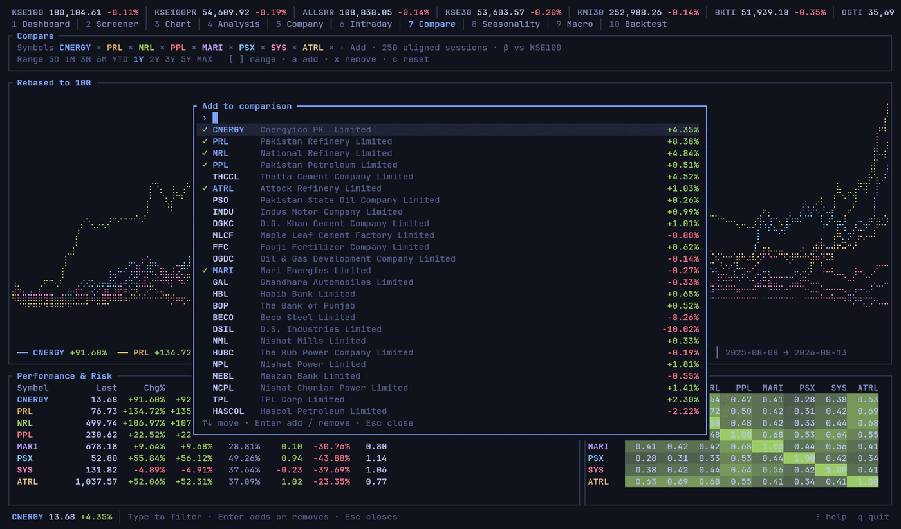

- **`a`, `+`, `/` or clicking `+ Add`** opens the picker. Type to filter by
  ticker or company name; a symbol prefix ranks above a name match, and ties
  break on turnover, so the obvious answer is usually already under the cursor.
- **`Enter` (or a click) toggles** the row: already-compared symbols are shown
  ticked and the same keystroke removes them. The picker stays open so several
  can be added in one visit. `Esc`, or a click anywhere outside it, closes it.
- **Each chip carries its own `✕`** — one click, no double-click, and it drops
  that symbol without changing the selection. `x` removes the selected symbol
  from the keyboard, and `c` resets the set back to the watchlist seed.
- **A symbol with no local history is fetched** when you add it, so it fills in
  rather than sitting in the table as an empty row.
- **The screen seeds itself with four** — the selection, then the watchlist,
  then the day's most-traded names — and leaves room to grow to eight. `c` puts
  it back to that seed.

Up to eight symbols overlay at once — where the palette runs out of hues that
stay separable on a dark background. The chip row wraps and the legend packs
onto extra lines rather than hiding anything, so a full set is still readable on
an 80-column terminal; the correlation matrix folds away when the pane is too
narrow to hold it honestly.

## Backtesting

Screen `0` runs a strategy over the full cached history — about five years and
1,250 sessions per scrip — and shows what it would have done.

Strategies are TOML files in the strategies directory
([where things live](#where-things-live)). Eight well-known ones ship with the
binary and install themselves the first time you open the screen: Golden Cross,
Connors RSI(2), Turtle breakout, MACD crossover, Bollinger reversion, absolute
momentum, Wilder's ADX/DI system, and a triple-MA ribbon. Each file credits its
source.

```toml
name = "Golden Cross"
about = "Buy when the 50-day average crosses above the 200-day."

[params]
fast = { default = 50,  min = 10, max = 100, step = 5 }
slow = { default = 200, min = 50, max = 300, step = 10 }

[indicators]
f = "sma(close, fast)"
s = "sma(close, slow)"

[rules]
entry = "cross_above(f, s)"
exit  = "cross_below(f, s)"
```

Drop a file in that directory and press `R` to import it. A file that does not
parse is reported by name with the reason — an unknown function, a period that
cannot be a period, a rule referencing something never declared — rather than
silently failing to appear.

`[params]` carries the bounds, and everything else follows from them: `←`/`→`
tweaks the selected parameter, `s` sweeps every combination, and `W` optimises
each walk-forward window. One declaration, three uses.

**Expressions.** Columns `close`, `open`, `high`, `low`, `volume`, `typical`;
operators `+ - * /`, `> >= < <= == !=`, `and`/`or`/`not`; and the functions
`sma ema rsi atr obv cci williams_r macd macd_signal macd_hist bb_upper bb_mid
bb_lower stoch_k stoch_d adx di_plus di_minus donchian_upper donchian_lower
donchian_mid highest lowest change pct_change prev cross_above cross_below abs
min max`. Everything is a whole aligned column, so an indicator's warm-up is
`None` and a rule built on it is undefined rather than accidentally true.
Optional top-level keys: `direction = "short"`, `stop_loss_pct`,
`take_profit_pct`, `min_hold_bars`, and a `filter` rule that gates entries.

**Views** (`v` cycles): equity curve against buy-and-hold, the trade list,
the parameter sweep, walk-forward folds, and a scan of the strategy across the
market's most liquid 150 symbols.

### True intraday range

PSX's long-run EOD feed carries close, volume and open — **no high or low**. A
fresh install therefore has real intraday extremes only for the ~120 days the
first-run backfill covers; everywhere else `high` and `low` are derived from
open and close. Anything reading them — ATR, Stochastic, ADX, Donchian, an
intrabar stop — is working from a range that was never traded.

The daily `/historical` snapshot does carry true OHLC, and one request covers
the **entire market** for a day, back to at least 2013. So the gap is fixable:
press `O` on the Backtest screen and psxtui fetches a snapshot per cached
session, roughly a second each. About 20 minutes for five years, in the
background, once. Coverage is then reported as a number beside any strategy
that depends on it, and the caveat disappears at 100%.

Two details that are not obvious and cost real accuracy if ignored:

- **`/historical` throttles harder than the rest of the portal**, and a
  throttled response is byte-identical to a public holiday — HTTP 200, same
  empty table. Measured against the live site, a 350ms gap had five of eight
  requests answered with an empty table; 700ms had none. psxtui spaces these
  requests a second apart for margin.
- **An empty answer is therefore never trusted on its own.** A day is recorded
  as a holiday only when the EOD series agrees it never traded — the EOD feed
  only carries a close for a session that actually happened. Otherwise the day
  is left alone and retried, so a throttled request can never permanently
  mislabel a trading day.

### What it will not pretend

Backtests are easy to make lie, so this one is built to argue with you.

- **No look-ahead.** A signal computed from bar *i* fills at bar *i+1*'s open —
  structurally, not by convention. There is no code path that fills at the
  signal bar's own price, so no strategy file can ask for one. A signal on the
  last bar never trades.
- **Costs are charged by default** (10bp commission + 5bp slippage, shown in the
  parameter panel). A frictionless backtest flatters everything, and flatters
  strategies that trade often most.
- **No intrabar fills.** Stops are evaluated at the close, never against a
  bar's high or low. See [true intraday range](#true-intraday-range) for why,
  and how to fix it.
- **Buy-and-hold is always on the chart.** A strategy that trails it cost money
  to run.
- **Thin or implausible results are flagged** — fewer than ten trades, or a
  Sharpe above 3, which is far more often a data artefact than an edge.
- **Walk-forward is the real answer.** The tweak panel is a curve-fitting
  machine by construction. `W` optimises on each training window and scores on
  the untouched window after it; the efficiency ratio (out-of-sample ÷
  in-sample) says how much of the tuning was real. Below ~0.3, none of it was.
- **Survivorship is unfixable here.** PSX's symbol list holds currently-listed
  scrips, so anything delisted is absent and every market-wide aggregate is
  biased upward. The scan says so on screen.

## How it gets data

PSX publishes no API, so `psxtui` reads the public data portal at
`dps.psx.com.pk` — two JSON feeds plus scraped HTML:

| Source | Used for |
|--------|----------|
| `/symbols` | Master list of instruments, sector names, ETF/debt flags |
| `/market-watch` | Live board — OHLC, change, volume for every scrip |
| `/timeseries/eod/<SYM>` | Long-run daily history (also works for indices like `KSE100`) |
| `/timeseries/int/<SYM>` | Intraday trade ticks |
| `POST /historical` | Whole-market OHLC for one date — the only source of true daily high/low |
| `/company/<SYM>` | Profile, financials, ratios, announcements |

### External context (Macro screen)

All unauthenticated, no API keys:

| Source | Used for |
|--------|----------|
| Yahoo Finance chart API | Energy (Brent, WTI, gas), metals (gold, silver, copper, steel HRC, aluminium), agriculture (cotton, wheat, sugar, soybean oil), USD/PKR, S&P 500 |
| Yahoo Finance (crypto) | BTC, ETH, SOL, BNB, XRP — a retail risk-appetite gauge, not a sector driver |
| Yahoo Finance (`BDRY`) | Dry-bulk freight — a **proxy** ETF, not the Baltic Dry Index, which isn't freely available |
| Business Recorder / Dawn RSS | Business and market headlines, matched to the selected scrip |
| `sbp.org.pk` | SBP policy rate, which feeds the risk-free rate in Sharpe and Sortino |

Correlations against these are computed on **date-aligned** returns — PSX and
global markets keep different holiday calendars, so the series are intersected
by trading day before anything is compared.

Port throughput and trade-flow volumes were investigated and dropped: neither
Karachi Port Trust nor Port Qasim publishes a machine-readable feed, and
inventing a number is worse than omitting one.

Two details worth knowing:

- **The EOD feed has no high or low.** It returns `[timestamp, close, volume, open]`
  only. Real intraday extremes come from the daily `/historical` snapshot, which
  covers every symbol in a single request. The cache merges the two and a
  derived range is never allowed to overwrite a true one — so ATR and
  candlestick wicks are honest.
- **Market-watch reports sector *codes*** (`0825`), not names. These are joined
  against `/symbols` so every screen can show `COMMERCIAL BANKS`.

### Caching

Everything fetched is persisted to SQLite (`~/.local/share/psxtui/psx.db`), so
the app opens instantly on cached data, analysis runs offline, and history
accumulates over time. On first run it backfills ~120 days of true OHLC in the
background — one request per trading day, marking holidays so they are never
refetched. Backfill runs on its own task and never blocks an interactive load.

Requests are deliberately paced (one at a time, ≥350 ms apart, bounded retries)
so the tool behaves like a single person browsing rather than a crawler.

## Architecture

```
src/
  psx/        HTTP client + JSON feeds + HTML scrapers (one module per source)
  cache/      SQLite store; merges EOD and /historical into one bar series
  analysis/   indicators.rs (SMA/EMA/RSI/MACD/Bollinger/ATR/OBV/VWAP/Stochastic)
              stats.rs      (returns, volatility, Sharpe, Sortino, drawdown, beta)
  backtest/   expr.rs     the series language strategy files are written in
              strategy.rs the TOML schema, its validation and loading
              engine.rs   bar-by-bar simulation; owns the look-ahead guarantee
              report.rs   metrics, and the caveats shown beside them
              optimize.rs sweeps, walk-forward validation, universe scans
  data.rs     background worker — owns every network call and cache write
  app.rs      all application state and key handling
  ui/         one module per screen; rendering is a pure function of `App`
              theme.rs  the palettes, and the number formatting every screen shares
              paint.rs  one drawing vocabulary, drawn by either renderer below
              gfx.rs    rasteriser + kitty graphics protocol; braille elsewhere
```

Two invariants the code depends on:

1. **Indicator alignment.** Every indicator returns a `Vec<Option<f64>>` the
   same length as its input, with `None` for the warm-up window — so overlays
   zip straight onto the price series with no offset bookkeeping.
2. **No poisoned floats.** PSX data is full of thin scrips, limit-locked
   sessions and zero-volume days. No analysis function panics or returns `NaN`
   or infinity; degenerate cases collapse to documented sentinels.
3. **Fills come after signals.** The backtest engine raises an order on one bar
   and executes it on the next. Look-ahead bias is invisible in results, so it
   is prevented by the shape of the loop rather than by reviewing strategy
   files.

The backtester is synchronous: a run over five years of daily bars takes
microseconds, so a full parameter sweep fits between two frames and needs no
background task. That is also why it can afford an event-driven engine rather
than the vectorised shortcut Python backtesters take — the sweep and the equity
curve are produced by the same code, so they cannot disagree.

Charts aggregate bars into one candle per terminal column (first open, last
close, extreme high/low, summed volume) rather than dropping sessions, while
indicators stay computed on the *daily* series — so `SMA(20)` means twenty
sessions at every zoom level.

A chart is described once, in `ui/paint.rs`, and drawn either onto a braille
canvas or into a bitmap. Neither renderer knows what a candle is, and an
indicator added to the description appears in both — which is the point: two
copies of the same geometry would drift apart on the first change.

## Development

```sh
cargo test                     # unit tests, no network
cargo run --example live_smoke # exercises every parser against the live portal
./docs/capture.sh              # regenerate the README screenshots
```

`live_smoke` is the one that catches a PSX layout change — unit tests only prove
the parsers handle markup we wrote ourselves.

`capture.sh` drives the real binary in a fixed-size tmux pane and photographs
every screen, so the images above are reproducible rather than hand-cropped.
They show live PSX data from the session they were captured in.

CI (`.github/workflows/ci.yml`) runs the tests on Linux, macOS **and Windows** —
development happens on Linux, so the Windows job is the only thing keeping that
support honest. `release.yml` builds the prebuilt binaries for every platform on
a `v*` tag. It publishes the Windows build twice — a bare `.exe` for anyone
downloading by hand, and a `.zip` whose name is a contract with `install.ps1`,
which looks for an asset ending in `x86_64-pc-windows-msvc.zip`. Keep the two in
step if either is renamed.

## Notes

Data is sourced from the PSX data portal for personal use. PSX's terms of use
restrict systematic retrieval; the client is rate-limited and caches
aggressively to stay well within the behaviour of an ordinary browser, but you
are responsible for how you use it. Nothing here is investment advice.
