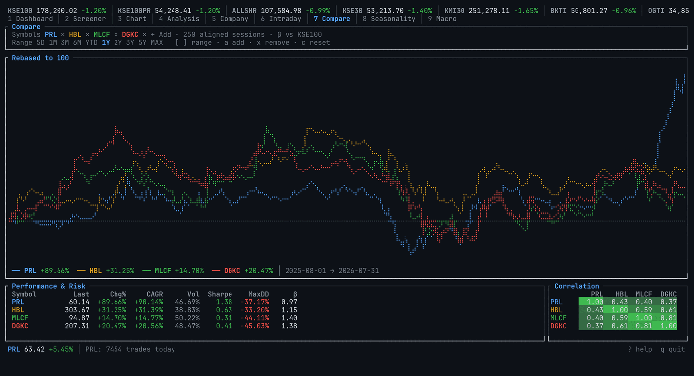

# psxtui

A terminal client for **Pakistan Stock Exchange** market data — live quotes, a
full-market screener, candlestick charts with technical indicators, risk and
return analytics, company fundamentals, and intraday microstructure.


## Screens

| # | Screen | What it shows |
|---|--------|---------------|
| 1 | **Dashboard** | Market breadth, top gainers/losers, most active by value, scrollable sector heatmap |
| 2 | **Screener** | Every listed scrip — sortable and filterable by symbol, name or sector, plus valuation columns |
| 3 | **Chart** | Candlesticks with SMA/EMA/Bollinger/Donchian/Ichimoku, and a Volume / RSI / MACD / ATR / Stochastic / ADX / CCI / Williams %R pane |
| 4 | **Analysis** | Returns by window, annualized return & volatility, Sharpe, Sortino, max drawdown, beta and correlation vs KSE100 |
| 5 | **Company** | Business profile, key people, equity structure, annual & quarterly financials, ratios, announcements |
| 6 | **Intraday** | Session price with VWAP, 15-minute volume distribution, live trade tape |
| 7 | **Compare** | 2-4 scrips side by side — rebased performance overlay, risk table, correlation matrix |
| 8 | **Seasonality** | Month-by-year return grid, day-of-week effects, return distribution, streaks |
| 9 | **Macro** | 20 external series — energy, metals, agriculture, freight, FX, crypto — plus the SBP policy rate and business news, with correlation to the selected scrip |

Timeframes: 5D, 1M, 3M, 6M, YTD, 1Y, 2Y, 3Y, 5Y and MAX.

<table>
<tr><td width="50%"><a href="docs/chart.png"></a><br><b>Chart</b> — candles, SMA/EMA overlays, volume pane</td>
<td width="50%"><a href="docs/compare.png"></a><br><b>Compare</b> — rebased overlay, risk table, correlations</td></tr>
<tr><td><a href="docs/screener.png"></a><br><b>Screener</b> — every listed scrip, sortable</td>
<td><a href="docs/macro.png"></a><br><b>Macro</b> — commodities, FX, policy rate, headlines</td></tr>
</table>

<details>
<summary>The other five screens</summary>

| | |
|---|---|
| **Analysis** |  |
| **Company** |  |
| **Intraday** |  |
| **Seasonality** |  |
| **Keys (`?`)** |  |

</details>


## Install

No API key, no account, no configuration. You need a terminal with 256-colour
and Unicode support, and Rust **1.88 or newer** (the code uses let-chains).

### The script

`install.sh` does the whole thing end to end: it installs a Rust toolchain if
there isn't a usable one, builds a release binary, and puts `psxtui` on your
PATH.

```sh
git clone https://github.com/AnnanKhan/PSXtui.git
cd PSXtui
./install.sh
psxtui
```

| Flag | Effect |
|------|--------|
| *(none)* | Install for the current user into `~/.cargo/bin` |
| `--system` | Install into `/usr/local/bin` instead (uses `sudo`) |
| `--no-modify-path` | Never touch your shell profile |
| `--uninstall` | Remove the binary; the cache and watchlist stay |

It only appends to `~/.bashrc` / `~/.zshrc` / `~/.profile` when `~/.cargo/bin`
is genuinely missing from your PATH, and prints every step as it goes. Re-run it
any time to update after a `git pull`.

### By hand

The same four steps, if you would rather run them yourself:

```sh
# 1. a toolchain (skip if `rustc --version` already reports 1.88+)
curl --proto '=https' --tlsv1.2 -sSf https://sh.rustup.rs | sh -s -- -y
. "$HOME/.cargo/env"

# 2. the sources
git clone https://github.com/AnnanKhan/PSXtui.git && cd PSXtui

# 3. build — first release build takes a few minutes
cargo build --release

# 4a. run it straight out of the build directory
./target/release/psxtui

# 4b. …or install it onto your PATH
cargo install --path .
```

`cargo install` drops the binary in `~/.cargo/bin`, which rustup already adds to
PATH. If `psxtui` still isn't found, add it yourself:

```sh
echo 'export PATH="$HOME/.cargo/bin:$PATH"' >> ~/.bashrc && exec $SHELL
```

**Dependencies.** TLS is rustls and SQLite is bundled, so there are no `-dev`
packages to hunt down — but compiling that bundled SQLite needs a C compiler:
`build-essential` on Debian/Ubuntu, `gcc` on Fedora, `xcode-select --install` on
macOS.

**Uninstalling.** `./install.sh --uninstall`, or `cargo uninstall psxtui`. Both
leave your cache and watchlist at `~/.local/share/psxtui/psx.db`; delete that
file to remove them too.

```
psxtui --version    # 0.1.0
psxtui --help       # the two flags there are; everything else is inside the app
```

## Keys

Press `?` in the app for the full list.

| Key | Action |
|-----|--------|
| `1`–`9`, `Tab` | Switch screen |
| `/` | Search by symbol, company or sector |
| `j`/`k`, `↑`/`↓` | Move cursor · `Enter` opens in the chart |
| `s` / `S` | Cycle sort column / reverse |
| `W` / `e` | Watchlist only / equities only |
| `w` | Add or remove the current symbol from the watchlist |
| `[` / `]` | Chart range · `i` cycles the indicator pane |
| `c` | Chart style: candles → line → dots → area |
| `m` / `e` / `b` | Toggle SMA / EMA / Bollinger overlays |
| `a` / `x` | Compare: add a symbol (opens the picker) / remove one · `c` resets |
| `r` | Refresh · `q` quit |
| `M` | Mouse on/off (off restores terminal text selection) |

### Mouse

Click a tab to switch screen, a row to select it, and double-click to open it in
the chart. The wheel scrolls whatever list is under the pointer, and over either
chart it changes timeframe. Everything the screens draw as a control is clickable:

- **Chart** — range buttons, overlay toggles, the style indicator and the
  indicator-pane title.
- **Screener** — column headers sort (click the active one to reverse), the
  panel title swaps in the valuation view, and the footer's `sort`, `watchlist`
  and `equities` readouts are switches.
- **Compare** — the range buttons, `+ Add`, and the symbol chips: click a chip's
  name to select it, its `✕` to drop it (see below).
- **Dashboard, Company, Macro** — boards, the sector heatmap, tabs,
  announcements, series and headlines.

Mouse reporting takes over the terminal's own text selection, so `M` turns it
off when you want to copy something out (holding Shift also works in most
terminals).

### Editing a comparison

The Compare screen is edited from the screen itself — there is no round trip
through the screener to pick up a symbol first.


- **`a`, `+`, `/` or clicking `+ Add`** opens the picker. Type to filter by
  ticker or company name; a symbol prefix ranks above a name match, and ties
  break on turnover, so the obvious answer is usually already under the cursor.
- **`Enter` (or a click) toggles** the row: already-compared symbols are shown
  ticked and the same keystroke removes them. The picker stays open so several
  can be added in one visit. `Esc`, or a click anywhere outside it, closes it.
- **Each chip carries its own `✕`** — one click, no double-click, and it drops
  that symbol without changing the selection. `x` removes the selected symbol
  from the keyboard, and `c` resets the set back to the watchlist seed.
- **A symbol with no local history is fetched** when you add it, so it fills in
  rather than sitting in the table as an empty row.

Up to four symbols overlay at once — as many distinct colours as one set of axes
carries before the eye stops separating them.

## How it gets data

PSX publishes no API, so `psxtui` reads the public data portal at
`dps.psx.com.pk` — two JSON feeds plus scraped HTML:

| Source | Used for |
|--------|----------|
| `/symbols` | Master list of instruments, sector names, ETF/debt flags |
| `/market-watch` | Live board — OHLC, change, volume for every scrip |
| `/timeseries/eod/<SYM>` | Long-run daily history (also works for indices like `KSE100`) |
| `/timeseries/int/<SYM>` | Intraday trade ticks |
| `POST /historical` | Whole-market OHLC for one date — the only source of true daily high/low |
| `/company/<SYM>` | Profile, financials, ratios, announcements |

### External context (Macro screen)

All unauthenticated, no API keys:

| Source | Used for |
|--------|----------|
| Yahoo Finance chart API | Energy (Brent, WTI, gas), metals (gold, silver, copper, steel HRC, aluminium), agriculture (cotton, wheat, sugar, soybean oil), USD/PKR, S&P 500 |
| Yahoo Finance (crypto) | BTC, ETH, SOL, BNB, XRP — a retail risk-appetite gauge, not a sector driver |
| Yahoo Finance (`BDRY`) | Dry-bulk freight — a **proxy** ETF, not the Baltic Dry Index, which isn't freely available |
| Business Recorder / Dawn RSS | Business and market headlines, matched to the selected scrip |
| `sbp.org.pk` | SBP policy rate, which feeds the risk-free rate in Sharpe and Sortino |

Correlations against these are computed on **date-aligned** returns — PSX and
global markets keep different holiday calendars, so the series are intersected
by trading day before anything is compared.

Port throughput and trade-flow volumes were investigated and dropped: neither
Karachi Port Trust nor Port Qasim publishes a machine-readable feed, and
inventing a number is worse than omitting one.

Two details worth knowing:

- **The EOD feed has no high or low.** It returns `[timestamp, close, volume, open]`
  only. Real intraday extremes come from the daily `/historical` snapshot, which
  covers every symbol in a single request. The cache merges the two and a
  derived range is never allowed to overwrite a true one — so ATR and
  candlestick wicks are honest.
- **Market-watch reports sector *codes*** (`0825`), not names. These are joined
  against `/symbols` so every screen can show `COMMERCIAL BANKS`.

### Caching

Everything fetched is persisted to SQLite (`~/.local/share/psxtui/psx.db`), so
the app opens instantly on cached data, analysis runs offline, and history
accumulates over time. On first run it backfills ~120 days of true OHLC in the
background — one request per trading day, marking holidays so they are never
refetched. Backfill runs on its own task and never blocks an interactive load.

Requests are deliberately paced (one at a time, ≥350 ms apart, bounded retries)
so the tool behaves like a single person browsing rather than a crawler.

## Architecture

```
src/
  psx/        HTTP client + JSON feeds + HTML scrapers (one module per source)
  cache/      SQLite store; merges EOD and /historical into one bar series
  analysis/   indicators.rs (SMA/EMA/RSI/MACD/Bollinger/ATR/OBV/VWAP/Stochastic)
              stats.rs      (returns, volatility, Sharpe, Sortino, drawdown, beta)
  data.rs     background worker — owns every network call and cache write
  app.rs      all application state and key handling
  ui/         one module per screen; rendering is a pure function of `App`
```

Two invariants the code depends on:

1. **Indicator alignment.** Every indicator returns a `Vec<Option<f64>>` the
   same length as its input, with `None` for the warm-up window — so overlays
   zip straight onto the price series with no offset bookkeeping.
2. **No poisoned floats.** PSX data is full of thin scrips, limit-locked
   sessions and zero-volume days. No analysis function panics or returns `NaN`
   or infinity; degenerate cases collapse to documented sentinels.

Charts aggregate bars into one candle per terminal column (first open, last
close, extreme high/low, summed volume) rather than dropping sessions, while
indicators stay computed on the *daily* series — so `SMA(20)` means twenty
sessions at every zoom level.

## Development

```sh
cargo test                     # unit tests, no network
cargo run --example live_smoke # exercises every parser against the live portal
./docs/capture.sh              # regenerate the README screenshots
```

`live_smoke` is the one that catches a PSX layout change — unit tests only prove
the parsers handle markup we wrote ourselves.

`capture.sh` drives the real binary in a fixed-size tmux pane and photographs
every screen, so the images above are reproducible rather than hand-cropped.
They show live PSX data from the session they were captured in.

## Notes

Data is sourced from the PSX data portal for personal use. PSX's terms of use
restrict systematic retrieval; the client is rate-limited and caches
aggressively to stay well within the behaviour of an ordinary browser, but you
are responsible for how you use it. Nothing here is investment advice.
